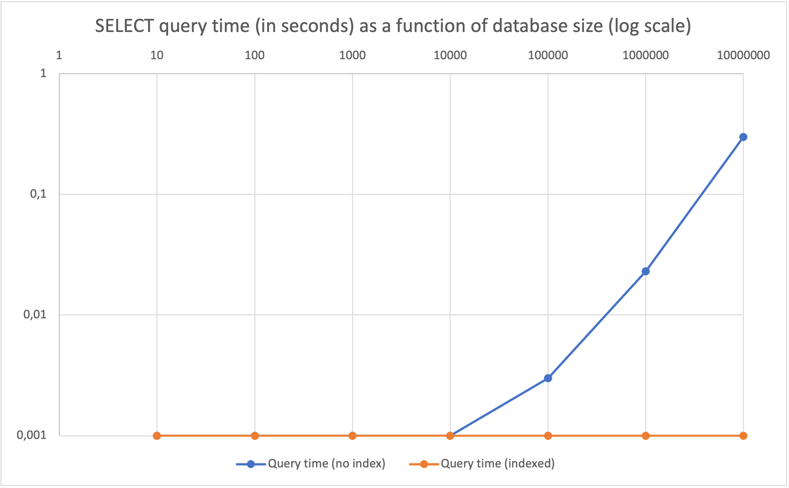

# Contacts database

*Goal: measure performance of a simple application in two scenarios -
with and without a SQL index*

# Step 1 - measure performance without an index

* Create a 'contacts' table

Hint: You may use the following SQL code:

```sql
CREATE TABLE contacts(
  id INTEGER PRIMARY KEY,
  name TEXT NOT NULL,
  email TEXT NOT NULL
)
```

* Write a `generateContacts` method (or function) that knows
  how to generate many contacts, with a reasonable space complexity.

For instance:

```javascript
// Note: this does _not_ generate a list of `numContacts` elements
function * generateContacts (numContacts) {
  let i = 1
  while (i <= numContacts) {
    yield [`name-${i}`, `email-${i}@domain.tld`]
    i++
  }
}
```

* Given a number `n` of contacts passed as a command line argument, generate
  `n` contacts and insert them in the database. `n` can be as big as 1 million.

*Note: inserting contacts one by one will be to slow, but inserting 1millions contacts at once
will probably not work either. You'll have to be smart.*

* Write code to measure the time it takes to retrieve the name of the **last** contact from the database
  given its email.

For instance:

```java
String email = String.format("email-%d@domain.tld", numContacts);
long start = System.currentTimeMillis();
String query = "SELECT name FROM contacts WHERE email = ?";
long end = System.currentTimeMillis();
long elapsed = end - start;
System.out.format("Query took %f seconds\n", elapsed / 1000.0);
```

* Create a table matching the size of the database with the duration of
  the query (in milliseconds):

| size    | time (in ms) |
|---------|--------------|
| 10      | ...          |
| 100     | ...          |
| 10000   | ...          |
| 10,000  | ...          |
| 50,000  | ...          |
| 100,000 | ...          |
| ...     | ...          |


Make a graph from the table. Does the result match what you would expect ?

# Step 2 - measure performance with an index

Redo the measurements, but this time, create an index *before* inserting the contacts:

```sql
CREATE TABLE contacts(
  id INTEGER PRIMARY KEY,
  name TEXT NOT NULL,
  email TEXT NOT NULL
)

CREATE UNIQUE INDEX index_contacts_email ON contacts(email);
```

Make a graph for the new result. Does it match what you would expect ?

# Result


We see that the time complexity is roughly O(n) without an index, while adding an index makes that constant time